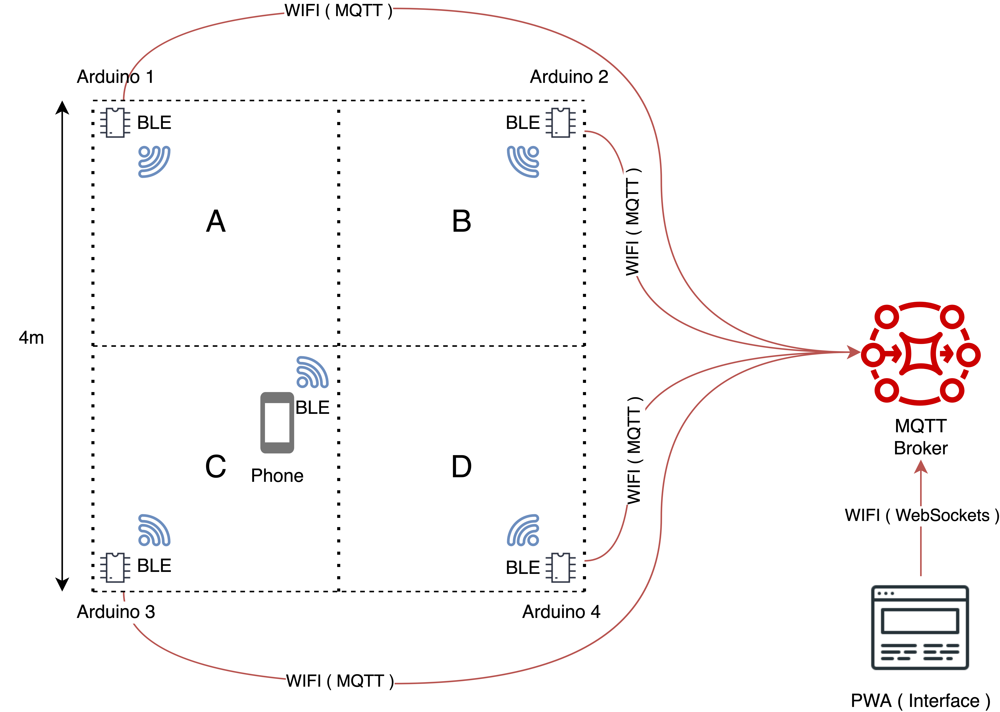

# Project: Pump it up!

Components:
- <strong>Arduino (4)</strong>: will be used as a BL scanning sensor, in the case the sensor is not accurate enough, we may need a specific module for this.
- <strong>BLE Sensor (4)</strong>: in case the previous fails.
- <strong>Raspberry Pi (1)</strong>: will be used as the processing unit, it will receive the data from the Arduinos and will serve a web page to interface with, in case its not powerful enough, we may use our laptops instead.
- <strong>Led diode (4)</strong>: led diods that will represent the sector of the arduino, each of different colorus ( red, blue, green, yellow ).

